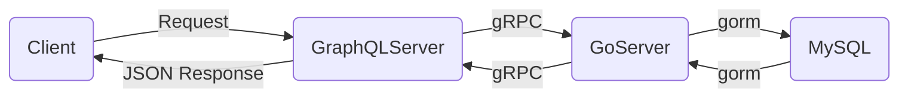

# アーキテクチャ

```mermaid
flowchart LR
    id1(Client) -- Request --> id2(GraphQLServer) -- JSON Response -->  id1
    id2 -- gRPC --> id3(GoServer) -- gRPC --> id2
    id3 -- gorm --> id4(MySQL) -- gorm --> id3
```
